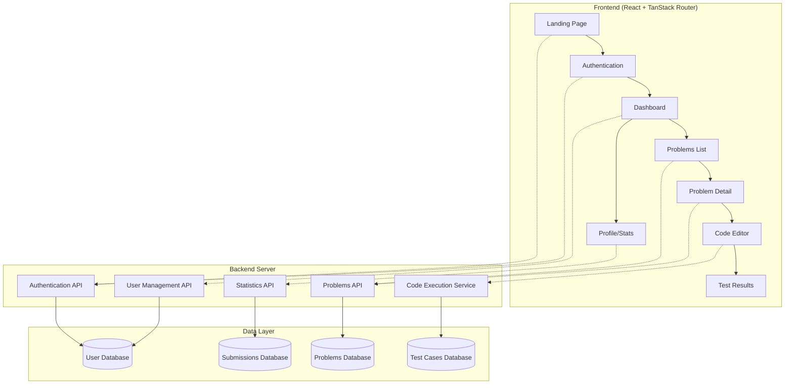

# Design Document

## Overview

This design document outlines the technical architecture for a competitive programming platform consisting of a React frontend built with TanStack Router and a backend server. The platform will provide users with coding challenges, real-time code execution, and progress tracking through a modern, responsive interface.

## Architecture

### System Architecture



### Frontend Architecture

The frontend will be structured using TanStack Router's file-based routing system with the following key architectural decisions:

- **Component Library**: Shadcn/UI for consistent, accessible components
- **State Management**: TanStack Query for server state, React Context for client state
- **Styling**: Tailwind CSS with component-level customization
- **Code Editor**: Monaco Editor for syntax highlighting and IntelliSense
- **Theme System**: CSS variables with light/dark mode support

### Backend Architecture

The backend will provide RESTful APIs with the following services:

- **Authentication Service**: JWT-based authentication with refresh tokens
- **Problems Service**: CRUD operations for coding problems and test cases
- **Code Execution Service**: Secure sandboxed code execution with multiple language support
- **User Service**: Profile management and progress tracking
- **Statistics Service**: Aggregated user statistics and leaderboards

## Components and Interfaces

### Frontend Components

#### Core Layout Components

```typescript
// Root layout with navigation and theme provider
interface RootLayoutProps {
    children: React.ReactNode
}

// Navigation component with user authentication state
interface NavigationProps {
    user?: User
    onLogout: () => void
}

// Theme toggle component
interface ThemeToggleProps {
    theme: 'light' | 'dark'
    onThemeChange: (theme: 'light' | 'dark') => void
}
```

#### Authentication Components

```typescript
interface LoginFormProps {
    onLogin: (credentials: LoginCredentials) => Promise<void>
    loading?: boolean
}

interface RegisterFormProps {
    onRegister: (userData: RegisterData) => Promise<void>
    loading?: boolean
}

interface ProtectedRouteProps {
    children: React.ReactNode
    fallback?: React.ReactNode
}
```

#### Problem Components

```typescript
interface ProblemsListProps {
    problems: Problem[]
    filters: ProblemFilters
    onFilterChange: (filters: ProblemFilters) => void
    loading?: boolean
}

interface ProblemCardProps {
    problem: Problem
    userProgress?: UserProblemProgress
    onClick: (problemId: string) => void
}

interface ProblemDetailProps {
    problem: Problem
    userSubmissions?: Submission[]
}
```

#### Code Editor Components

```typescript
interface CodeEditorProps {
    language: ProgrammingLanguage
    value: string
    onChange: (value: string) => void
    onRun: () => void
    onSubmit: () => void
    loading?: boolean
}

interface TestResultsProps {
    results: TestResult[]
    loading?: boolean
}

interface LanguageSelectorProps {
    languages: ProgrammingLanguage[]
    selected: ProgrammingLanguage
    onSelect: (language: ProgrammingLanguage) => void
}
```

### Backend API Interfaces

#### Authentication Endpoints

```typescript
POST / api / auth / register
POST / api / auth / login
POST / api / auth / refresh
POST / api / auth / logout
POST / api / auth / forgot - password
POST / api / auth / reset - password
```

#### Problems Endpoints

```typescript
GET /api/problems?page=1&limit=20&difficulty=easy&topic=arrays
GET /api/problems/:id
GET /api/problems/:id/submissions
POST /api/problems/:id/run
POST /api/problems/:id/submit
```

#### User Endpoints

```typescript
GET / api / users / profile
PUT / api / users / profile
GET / api / users / statistics
GET / api / users / submissions
```

## Data Models

### User Model

```typescript
interface User {
    id: string
    username: string
    email: string
    avatar?: string
    createdAt: Date
    updatedAt: Date
    statistics: UserStatistics
}

interface UserStatistics {
    totalSolved: number
    easySolved: number
    mediumSolved: number
    hardSolved: number
    currentStreak: number
    maxStreak: number
    acceptanceRate: number
    ranking: number
}
```

### Problem Model

```typescript
interface Problem {
    id: string
    title: string
    description: string
    difficulty: 'easy' | 'medium' | 'hard'
    topics: string[]
    constraints: string
    examples: Example[]
    testCases: TestCase[]
    acceptanceRate: number
    totalSubmissions: number
    createdAt: Date
}

interface Example {
    input: string
    output: string
    explanation?: string
}

interface TestCase {
    input: string
    expectedOutput: string
    isHidden: boolean
}
```

### Submission Model

```typescript
interface Submission {
    id: string
    userId: string
    problemId: string
    code: string
    language: ProgrammingLanguage
    status:
        | 'pending'
        | 'accepted'
        | 'wrong_answer'
        | 'time_limit_exceeded'
        | 'runtime_error'
    executionTime?: number
    memoryUsage?: number
    testResults: TestResult[]
    submittedAt: Date
}

interface TestResult {
    input: string
    expectedOutput: string
    actualOutput: string
    passed: boolean
    executionTime: number
    memoryUsage: number
}
```

## Error Handling

### Frontend Error Handling

- **API Errors**: Centralized error handling using TanStack Query's error boundaries
- **Form Validation**: Real-time validation with clear error messages
- **Network Errors**: Retry logic with exponential backoff
- **Authentication Errors**: Automatic token refresh and redirect to login

### Backend Error Handling

- **Validation Errors**: Structured error responses with field-specific messages
- **Authentication Errors**: Proper HTTP status codes with clear error descriptions
- **Code Execution Errors**: Sandboxed execution with timeout and memory limits
- **Rate Limiting**: API rate limiting to prevent abuse

### Error Response Format

```typescript
interface ApiError {
    error: {
        code: string
        message: string
        details?: Record<string, string[]>
    }
    timestamp: string
    path: string
}
```

## Testing Strategy

### Frontend Testing

- **Unit Tests**: Component testing with React Testing Library
- **Integration Tests**: API integration testing with MSW (Mock Service Worker)
- **E2E Tests**: Critical user flows with Playwright
- **Accessibility Tests**: Automated accessibility testing with axe-core

### Backend Testing

- **Unit Tests**: Service and utility function testing
- **Integration Tests**: API endpoint testing with test database
- **Security Tests**: Authentication and authorization testing
- **Performance Tests**: Load testing for code execution service

### Test Coverage Goals

- Frontend: 80% code coverage for components and utilities
- Backend: 90% code coverage for business logic and APIs
- E2E: Coverage of all critical user journeys

## Security Considerations

### Authentication & Authorization

- JWT tokens with short expiration times
- Refresh token rotation
- Role-based access control for admin features
- Rate limiting on authentication endpoints

### Code Execution Security

- Sandboxed execution environment (Docker containers)
- Resource limits (CPU, memory, execution time)
- Network isolation for executed code
- Input sanitization and validation

### Data Protection

- HTTPS enforcement
- Input validation and sanitization
- SQL injection prevention
- XSS protection with Content Security Policy

## Performance Optimizations

### Frontend Performance

- Code splitting with React.lazy and TanStack Router
- Image optimization and lazy loading
- Bundle size optimization with tree shaking
- Caching strategies with TanStack Query

### Backend Performance

- Database indexing for frequently queried fields
- Response caching for static data
- Connection pooling for database connections
- Horizontal scaling for code execution service

### Monitoring and Analytics

- Performance monitoring with Web Vitals
- Error tracking and logging
- User analytics for feature usage
- API performance monitoring
